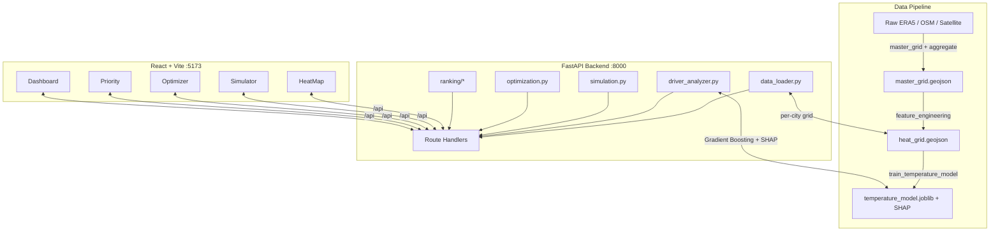

# UrbanCool AI

UrbanCool AI is a geospatial machine learning platform for **Urban Heat Island (UHI) analysis and cooling-strategy simulation**. It helps urban planners and researchers analyze land surface temperatures across a city grid, understand the spatial drivers of heat through SHAP explainability, rank the highest-priority zones for intervention, simulate cooling scenarios (tree cover, cool roofs, green roofs, water bodies) with neighbor spillover effects, and run budget-constrained optimization to allocate interventions city-wide.

The platform is **multi-city** and config-driven. It currently ships with data for **Ahmedabad** (default) and **Gandhinagar**, both in Gujarat, India.

---

## System Architecture

The project is split into three decoupled layers:

1. **Data pipeline** (`urban-cool/data/scripts/`) — fetches raw geospatial/weather data, aggregates it onto a uniform grid, engineers features, and trains the ML model.
2. **FastAPI backend** (`urban-cool/backend/` + `config/`, `ranking/`) — loads the processed grid and trained models into memory and serves REST endpoints.
3. **React frontend** (`urban-cool-frontend/`) — an interactive Vite + Tailwind client with a Leaflet map and Recharts visualizations.



### End-to-End Workflow

1. **Grid generation & ingestion** — The pipeline builds a uniform 500m grid over a city's bounding box (from `config/cities.json`) and populates each cell with spatial indices (NDVI, built-up density, road density, distance to water), weather (ERA5), satellite layers (Landsat 8, ECOSTRESS, Sentinel-2), air quality (CPCB), and physics-informed features (albedo, emissivity, sky view factor, energy-balance fluxes, Bowen ratio).
2. **Model training & explanations** — A **Gradient Boosting** regressor predicts land surface temperature from spatial, physics, spatial-lag, and engineered interaction features. A **SHAP TreeExplainer** is serialized alongside it to attribute per-cell and global feature contributions.
3. **API serving** — FastAPI loads the processed grid and trained models on startup (default city eagerly, others lazy-loaded on first request) and exposes endpoints for map rendering, cell lookups, drivers, hotspots, priority ranking, simulation, and optimization.
4. **Interactive client** — The React app renders the grid on a Leaflet map, lets users inspect any cell's attributes and SHAP drivers, simulate cooling scenarios, view priority rankings and recommendations, run budget optimization, and explore aggregated dashboards.

---

## Project Structure

```text
Urban-cool-main/
├── README.md                        # This file
├── Design.md                        # Brand / UI style reference
├── urban-cool/                      # Backend + data pipeline
│   ├── run_server.py                # Entrypoint: runs FastAPI on :8000
│   ├── .env.example                 # Template for API keys (CPCB, CDS, GCP)
│   ├── backend/
│   │   ├── main.py                  # FastAPI app, routes, CORS, multi-city validation
│   │   ├── data_loader.py           # Thread-safe per-city GeoJSON loader + dashboard stats
│   │   ├── driver_analyzer.py       # Gradient Boosting prediction + SHAP driver analysis
│   │   ├── simulation.py            # Spatial cooling simulation (KDTree + Gaussian kernel)
│   │   ├── optimization.py          # Greedy budget-constrained intervention allocation
│   │   ├── models.py                # Pydantic request schemas
│   │   ├── requirements.txt         # Python backend dependencies
│   │   └── config/
│   │       └── interventions.json   # Cooling coefficients per intervention type
│   ├── config/
│   │   ├── cities.json              # City definitions (bounds, water bodies, parks, stations)
│   │   └── config_loader.py         # City config + path helpers, loads .env
│   ├── ranking/
│   │   ├── priority_score.py        # Weighted priority scoring (heat/builtup/population)
│   │   └── recommendation_engine.py # Risk classification + intervention recommendations
│   ├── data/
│   │   ├── <city>/raw/              # Raw inputs (ERA5, OSM geojsons, metadata)
│   │   ├── <city>/intermediate/     # Grid-aggregated layers per source
│   │   ├── <city>/processed/        # heat_grid.geojson (map source) + metadata
│   │   └── scripts/                 # Fetch, aggregate, feature, and training scripts
│   │       ├── pipeline.py          # Main pipeline orchestrator
│   │       ├── master_grid.py       # Generates the base city grid
│   │       ├── aggregate_to_grid.py # Aggregates raw layers onto grid cells
│   │       ├── feature_engineering.py # Merges layers + derived features
│   │       ├── physics_features.py  # Energy-balance & physics-informed features
│   │       ├── train_temperature_model.py # Trains model + SHAP explainer
│   │       ├── fetch_*.py           # Data fetchers (ERA5/CDS, Landsat, Sentinel, OSM, OpenMeteo)
│   │       └── fetchers/            # ERA5 / OSM / CPCB / AppEEARS fetch helpers
│   ├── models/
│   │   ├── <city>/                  # Per-city model, SHAP explainer, validation report
│   │   ├── temperature_model.joblib # Trained Gradient Boosting model
│   │   └── temperature_shap.pkl     # Serialized SHAP explainer
│   └── tests/
│       └── test_all.py              # Data / model / API test suite
│
└── urban-cool-frontend/             # React + Vite frontend
    ├── package.json                 # Node dependencies + scripts
    ├── vite.config.js               # Dev server + /api proxy to :8000
    ├── index.html
    └── src/
        ├── main.jsx                 # React bootstrap
        ├── App.jsx                  # Tab-based page router
        ├── api.js                   # Fetch client (city-aware) for the backend
        ├── context/CityContext.jsx  # Global selected-city state
        ├── components/
        │   ├── Navbar.jsx           # Top navigation
        │   ├── CitySelector.jsx     # City switcher
        │   └── CellPanel.jsx        # Cell detail + SHAP driver sidebar
        └── pages/
            ├── HeatMap.jsx          # Leaflet grid map
            ├── Simulator.jsx        # Cooling scenario simulation
            ├── Optimizer.jsx        # Budget-constrained optimization
            ├── Priority.jsx         # Priority rankings + recommendations
            └── Dashboard.jsx        # Aggregated charts (Recharts)
```

---

## Setup & Installation

### Prerequisites
- Python 3.9+ (3.10+ recommended)
- Node.js 18+ and npm

### 1. Backend

```bash
# From the repository root, enter the backend project
cd urban-cool

# Create and activate a virtual environment
python -m venv venv
# Windows (cmd):
venv\Scripts\activate.bat
# Windows (PowerShell):
.\venv\Scripts\Activate.ps1
# macOS/Linux:
source venv/bin/activate

# Install dependencies
pip install -r backend/requirements.txt

# (Optional) configure API keys for data fetching
copy .env.example .env      # Windows
# cp .env.example .env       # macOS/Linux

# Start the API server on http://localhost:8000
python run_server.py
```

The pre-generated `heat_grid.geojson` and trained models are already committed, so the API serves data immediately without running the pipeline. The `.env` keys (CPCB, Copernicus CDS, Google Cloud) are only needed if you re-fetch raw data.

### 2. Frontend

```bash
# In a new terminal, from the repository root
cd urban-cool-frontend

# Install dependencies
npm install

# Start the Vite dev server on http://localhost:5173
# Requests to /api are proxied to the backend on http://localhost:8000
npm run dev
```

### 3. Tests

```bash
# With the virtual environment active, from the urban-cool directory
python tests/test_all.py
```

> **Note:** The backend binds to `127.0.0.1:8000` and allows CORS from `localhost:5173/5174` by default. Override allowed origins with the `CORS_ORIGINS` environment variable (comma-separated).

---

## API Reference

The backend runs on port `8000`. Most endpoints accept an optional `city` query parameter (defaults to `ahmedabad`).

| Endpoint | Method | Description |
| :--- | :--- | :--- |
| `/cities` | `GET` | List all configured cities and whether processed data is available. |
| `/cells` | `GET` | All grid cells with geometry + predicted/actual temperature for map rendering. |
| `/cells/{cell_id}` | `GET` | Full attributes for one cell (NDVI, built-up, satellite LST, AQI, physics features, etc.). |
| `/cells/{cell_id}/drivers` | `GET` | SHAP-based driver breakdown explaining why a cell is hot or cool. |
| `/drivers/global` | `GET` | Global SHAP feature importance across cells. |
| `/hotspots` | `GET` | Hottest cells, filterable by `min_temp` and `limit`. |
| `/simulate` | `POST` | Cooling simulation for a cell with spatial neighbor spillover. |
| `/optimize` | `POST` | Greedy budget-constrained allocation of interventions city-wide. |
| `/scenarios/compare` | `POST` | Side-by-side comparison of two optimization scenarios. |
| `/priority` | `GET` | All cells ranked by priority score with recommendations (`sort_by=score\|temperature`). |
| `/priority/top` | `GET` | Top `n` priority zones with recommendations. |
| `/dashboard` | `GET` | Aggregated stats (risk counts, temp min/avg/max, physics averages, radar data). |
| `/data-info` | `GET` | Data source timeline / freshness metadata. |
| `/validation` | `GET` | Spatial cross-validation metrics for the trained model. |

### Request bodies

`POST /simulate`
```json
{
  "cell_id": "AHM_0042",
  "tree_cover": 30,
  "cool_roof": 20,
  "green_roof": 10,
  "water_body": 0
}
```
All intervention values are percentages (0–100). The response includes before/after temperature, per-intervention reduction, spatial neighbor effects, and an energy-balance check.

`POST /optimize`
```json
{
  "budget": 5000000,
  "intervention_types": ["tree_cover", "cool_roof", "green_roof"],
  "intensity": 50,
  "max_per_cell": 1
}
```

---

## Machine Learning Model

- **Model:** Gradient Boosting regressor predicting land surface temperature (LST). The API converts predicted LST to estimated 2m air temperature using an ERA5-anchored scaling that varies with NDVI and urban fraction.
- **Explainability:** SHAP `TreeExplainer` provides per-cell and global feature attributions.
- **Feature groups** (see `backend/driver_analyzer.py`):
  - *Spatial:* NDVI, built-up density, distance to water, road density, sky view factor, building density, surface albedo.
  - *Physics:* emissivity, Bowen ratio (temperature is never used as an input, to avoid target leakage).
  - *Spatial lag:* neighbor NDVI and neighbor built-up (k-nearest-neighbor means).
  - *Engineered:* NDVI × built-up and distance × built-up interactions.

---

## Customizing & Extending

### Add a new city
1. Add an entry to [`urban-cool/config/cities.json`](urban-cool/config/cities.json) with `name`, `state`, `prefix` (cell-ID prefix), `bounds` (lat/lon min/max), `center`, `zoom`, `grid_size_m`, `risk_thresholds`, and optionally `water_bodies`, `parks`, and `cpcb_stations`.
2. Generate the data grid:
   ```bash
   python data/scripts/pipeline.py --city your_city_name
   # add --skip-fetch to reuse existing raw data
   ```
3. Train the model for the new city:
   ```bash
   python data/scripts/train_temperature_model.py
   ```
   Processed data lands in `data/<city>/processed/heat_grid.geojson` and models in `models/<city>/`. The city becomes available automatically once its `heat_grid.geojson` exists.

### Tune cooling coefficients
Edit [`urban-cool/backend/config/interventions.json`](urban-cool/backend/config/interventions.json). For example, setting `tree_cover.temp_reduction_per_percent` to `0.1` means each 1% increase in canopy reduces temperature by 0.1°C. Coefficients are loaded on demand by `/simulate`.

### Tune optimization costs
Intervention costs (INR) and cooling factors used by the greedy optimizer live in `INTERVENTION_COSTS` and `INTERVENTION_COOLING` in [`urban-cool/backend/optimization.py`](urban-cool/backend/optimization.py).

### Adjust priority weighting
Priority score weights (heat 0.7, built-up 0.2, population proxy 0.1) are defined in `WEIGHTS` in [`urban-cool/ranking/priority_score.py`](urban-cool/ranking/priority_score.py). Recommendation thresholds and actions live in [`recommendation_engine.py`](urban-cool/ranking/recommendation_engine.py).

### Re-train the model
Ensure any new feature columns are present in the processed GeoJSON and listed in the feature groups of [`backend/driver_analyzer.py`](urban-cool/backend/driver_analyzer.py) and the training script, then run `python data/scripts/train_temperature_model.py`. The FastAPI app picks up the new weights on the next (re)load.

---

## Tech Stack

**Backend:** Python, FastAPI, Uvicorn, Pydantic, scikit-learn (Gradient Boosting), SHAP, NumPy, pandas, SciPy (cKDTree), joblib.

**Frontend:** React 19, Vite, Tailwind CSS v4, React Leaflet / Leaflet, Recharts, lucide-react.

**Data sources:** ERA5 (Copernicus CDS), OpenStreetMap (roads/buildings), Landsat 8 & ECOSTRESS (LST), Sentinel-2 (LULC/NDVI), CPCB (air quality).
